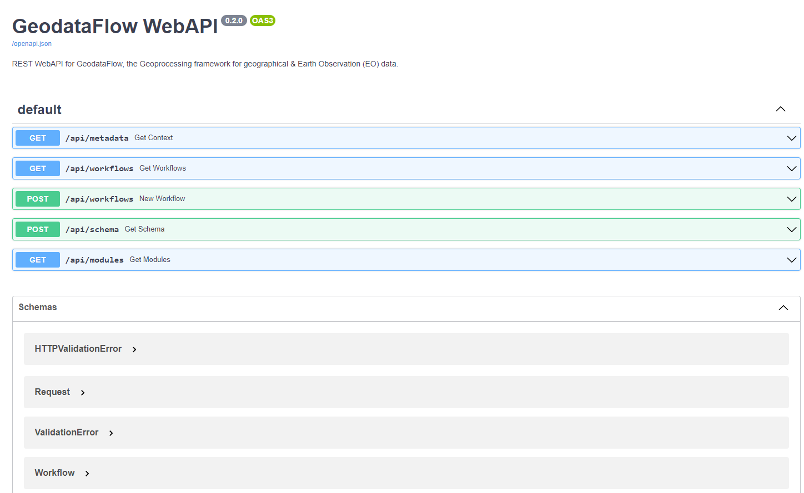
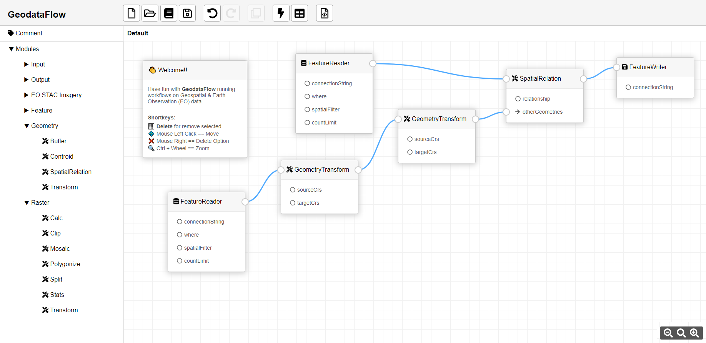

# GeodataFlow

Geospatial processing framework for geographical & Earth Observation (EO) data in Python.

**GeodataFlow** is a Geoprocessing framework for fetching, translating and manipulating Geospatial data (*Raster*, *Vector*, *EO/STAC collections*) by using a *Pipeline* or sequence of operations on input data. It is very much like the [_GDAL_](https://gdal.org/) library which handles raster and vector data.

The project is split up into several namespace packages or components:

* [geodataflow.core](geodataflow/core/)

  The main subpackage of **GeodataFlow** which implements basic building blocks (Pipeline engine & Modules) and commonly used functionalities.

* [geodataflow.api](geodataflow/api/)

  WebAPI component using [_FastAPI_](https://fastapi.tiangolo.com/) which provides access to GeodataFlow backend via API REST calls.

  

* [workbench/ui](geodataflow/ui/)

  GeodataFlow **Workbench** is a static _javascript_ application for users easily draw and run their own Workflows in the Web Browser.

  

  NOTE: There is no any installer for GeodataFlow **Workbench** yet, but you can test it loading the [docker-compose.yml](docker-compose.yml). Please, read related section below.

Backends:

* [spatial](geodataflow/spatial/)

  Installs the `geodataflow.spatial` backend implementation for GeodataFlow using _GDAL/OGR_.

* [dataframes](geodataflow/dataframes/)

  Installs the `geodataflow.dataframes` backend implementation for GeodataFlow using _Geopandas_.

* _pySpark_, _Geospatial SQL_, _... ?_

Videos demostrating **GeodataFlow**:
* [What is GeodataFlow](https://www.youtube.com/watch?v=jgWlyff2K00&list=PLEmI_ksy4QHaAg64XbwnHFpwaLc8Hbr4-&index=1)
* [Tranforming Features](https://www.youtube.com/watch?v=IJljavT-BZg&list=PLEmI_ksy4QHaAg64XbwnHFpwaLc8Hbr4-&index=2)
* [Reading items from a STAC Catalog](https://www.youtube.com/watch?v=XUJVZaMEDtc&list=PLEmI_ksy4QHaAg64XbwnHFpwaLc8Hbr4-&index=3)
* [Downloading a NDVI raster from a STAC Catalog](https://www.youtube.com/watch?v=NodnUUYZJkU&list=PLEmI_ksy4QHaAg64XbwnHFpwaLc8Hbr4-&index=4)
* [Filtering Features applying Spatial Relations](https://www.youtube.com/watch?v=5OxrXffwUeM&list=PLEmI_ksy4QHaAg64XbwnHFpwaLc8Hbr4-&index=5)
* [Plotting a NDVI Time Series Graph of a polygon](https://www.youtube.com/watch?v=qKuUW-PXizg&list=PLEmI_ksy4QHaAg64XbwnHFpwaLc8Hbr4-&index=6)
* [Loading Datasets from Google Earth Engine (GEE)](https://www.youtube.com/watch?v=qKuUW-PXizg&list=PLEmI_ksy4QHaAg64XbwnHFpwaLc8Hbr4-&index=7)
* [Preview the stages of a Workflow in a Table or Map](https://www.youtube.com/watch?v=qKuUW-PXizg&list=PLEmI_ksy4QHaAg64XbwnHFpwaLc8Hbr4-&index=8)

### Workflow examples

Assuming you are using `geodataflow.spatial` (GDAL/OGR) as active backend implementation, **GeodataFlow** can run workflows as the following:

+ Converting a Shapefile to GeoPackage:
  ```bash
  # ==============================================================
  # Pipeline sample to convert a Shapefile to GeoPackage.
  # ==============================================================
  {
    "pipeline": [
      {
        "type": "FeatureReader",
        "connectionString": "input.shp"
      },
      # Extract the Centroid of input geometries.
      {
        "type": "GeometryCentroid"
      },
      # Transform CRS of geometries.
      {
        "type": "GeometryTransform",
        "sourceCrs": 4326,
        "targetCrs": 32630
      },
      # Save features to Geopackage.
      {
        "type": "FeatureWriter",
        "connectionString": "output.gpkg"
      }
    ]
  }
  ```

+ Fetching metadata of a S2L2A Product (STAC):
  ```bash
  # ==============================================================
  # Pipeline sample to fetch metadata of a S2L2A Product (STAC).
  # ==============================================================
  {
    "pipeline": [
      {
        "type": "FeatureReader",

        # Define the input AOI in an embedded GeoJson.
        "connectionString": {
          "type": "FeatureCollection",
          "crs": {
            "type": "name",
            "properties": { "name": "EPSG:4326" }
          },
          "features": [
            {
              "type": "Feature",
              "properties": { "id": 0, "name": "My AOI for testing" },
              "geometry": {
                "type": "Polygon",
                "coordinates": [[
                    [-1.746826,42.773227],
                    [-1.746826,42.860866],
                    [-1.558685,42.860866],
                    [-1.558685,42.773227],
                    [-1.746826,42.773227]
                ]]
              }
            }
          ]
        }
      },
      # Transform CRS of geometries.
      {
        "type": "GeometryTransform",
        "sourceCrs": 4326,
        "targetCrs": 32630
      },
      # Fetch metadata of EO Products that match one SpatioTemporial criteria.
      {
        "type": "EOProductCatalog",

        "driver": "STAC",
        "provider": "https://earth-search.aws.element84.com/v0/search",
        "product": "sentinel-s2-l2a-cogs",

        "startDate": "2021-09-25",
        "endDate": "2021-10-05",
        "closestToDate": "2021-09-30",
        "filter": "",

        "preserveInputCrs": true
      },
      # Save features to Geopackage.
      {
        "type": "FeatureWriter",
        "connectionString": "output.gpkg"
      }
    ]
  }
  ```

## Installation

Because **GeodataFlow** is composed by several namespace packages, some of them are optional (e.g. Backend implementations). You will need to install the ones you want by adding them as an extra to the command-line that runs the installer.

In order to read and write Cloud Optimized Geotiffs (COG), GDAL version 3.1 or greater is required. If your system GDAL is older than version 3.1, consider using Docker or Conda to get a modern GDAL.

### Using pypi

To install the latest stable version from [_pypi_](https://pypi.org/), write this in the command-line:

```bash
> pip install geodataflow[api,dataframes,eodag,gee]
```

The `geodataflow` package installs `geodataflow.core` and `geodataflow.spatial` ones by default. You can use namespace package installers as well  (e.g. [api](/geodataflow/api/README.md#installation)), they have the same effect than the generic one.

Optional extras for Backends:

* eodag

  EODAG - [Earth Observation Data Access Gateway](https://eodag.readthedocs.io/en/stable/) is a Python package for searching and downloading remotely sensed images while offering an unified API for data access regardless of the data provider.

* gee

  GEE - [Google Earth Engine API](https://developers.google.com/earth-engine) is a geospatial processing service. With _Earth Engine_, you can perform geospatial processing at scale, powered by Google Cloud Platform. _GEE_ requires authentication, please, read available documentation [here](https://developers.google.com/earth-engine/guides/python_install#authentication).


To view all available CLI tool commands and options:
```bash
> geodataflow --help
```

Listing all available modules:
```bash
> geodataflow --modules
```

Run a workflow in the command-line interface:
```bash
> geodataflow --pipeline_file "/geodataflow/spatial/tests/data/test_eo_stac_catalog.json"
```

### Using docker-compose

[docker-compose.yml](docker-compose.yml) builds images and starts  GeodataFlow API and Workbench components to easily run Workflows with **GeodataFlow**.

`PACKAGE_WITH_GEODATAFLOW_PIPELINE_CONTEXT` in the yml file indicates the backend implementation to load. The default value is `geodataflow.spatial`. If you prefer to use another backend, please, change it before starting.

Write in the command-line from the root folder of the project:
```bash
> docker-compose up
```

Then, type in your favorite Web Browser:
* http://localhost:9630/docs to check the interface of the REST WebAPI service.
* http://localhost:9640/workbench.html to access to the Workbench UI designer and where you can design and run Workflows!

To remove all resources:
```bash
> docker-compose down --rmi all -v --remove-orphans
```

## Testing

Each package provides a collection of tests, run tests on `tests` folders to validate them.

## Contribute

Have you spotted a typo in our documentation? Have you observed a bug while running **GeodataFlow**? Do you have a suggestion for a new feature?

Don't hesitate and open an issue or submit a pull request, contributions are most welcome!

## License

**GeodataFlow** is licensed under Apache License v2.0.
See [LICENSE](LICENSE) file for details.

## Credits

**GeodataFlow** is built on top of amazingly useful open source projects. See [NOTICE](../../NOTICE) file for details about those projects
and their licenses.

Thank you to all the authors of these projects!

## Authors

**GeodataFlow** has been created by `Alvaro Huarte` <https://www.linkedin.com/in/alvarohuarte>.

