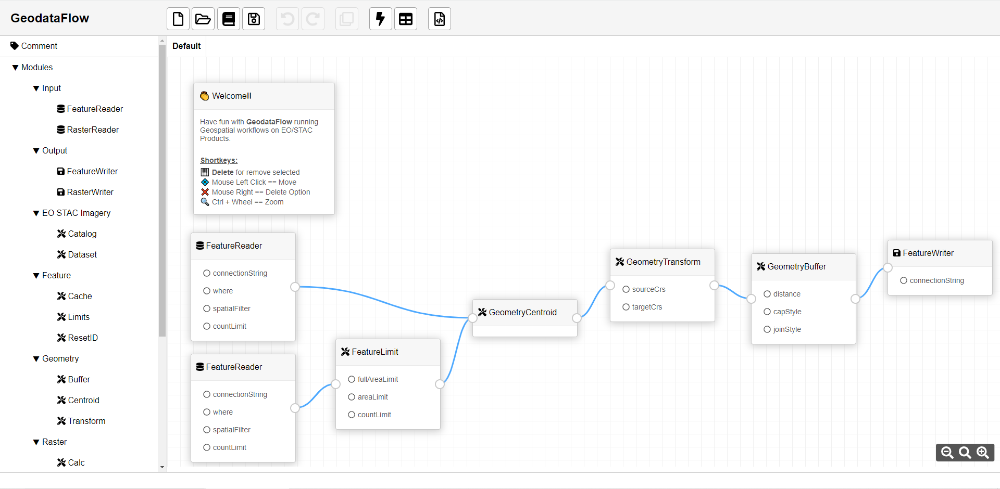
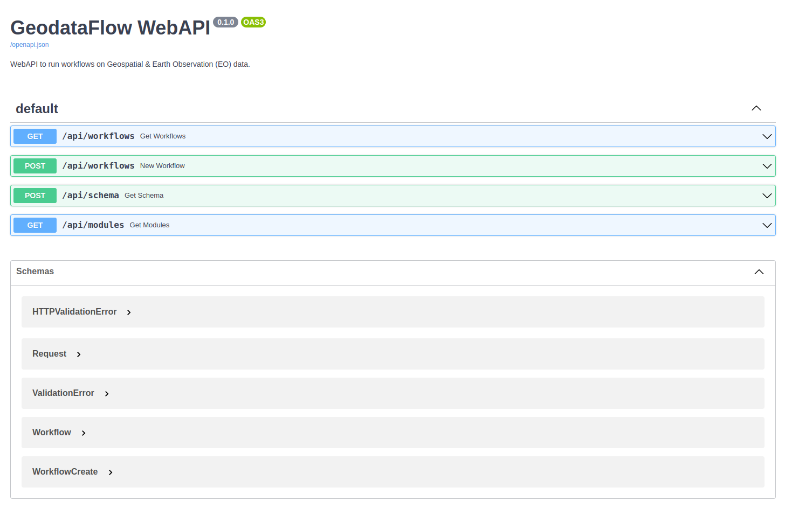

# GeodataFlow _(Work in progress)_

Toolkit to run workflows on Geospatial & Earth Observation (EO) data.

**GeodataFlow** is a Python library for fetching, translating and manipulating Geospatial data (*Raster*, *Vector*, *EO/STAC collections*) by using a *Pipeline* or sequence of operations on input data. It is very much like the GDAL library which handles raster and vector data. This page provides high level overview of the library and its philosophy. Visit docs to list data formats it supports (Readers & Writers), and see Filters for filtering operations that you can apply with GeodataFlow.

In addition to the library code, **GeodataFlow** provides a command-line application and a [REST WebAPI](#rest-api) (FastAPI) endpoint that users can conveniently use to process, filter, translate, and query Geospatial data. Applications provide more information on that topic.

**GeodataFlow** provides as well a [Workbench](#workbench) UI designer for users easily draw and run their own workflows.

Developers can extend **GeodataFlow** with new custom modules as well.


### Workflow examples

+ Converting a Shapefile to GeoPackage:
  ```bash
  # ==============================================================
  # Pipeline sample to convert a Shapefile to GeoPackage.
  # ==============================================================
  {
    "pipeline": [
      {
        "type": "FeatureReader",
        "connectionString": "input.shp"
      },
      # Extract the Centroid of input geometries.
      {
        "type": "GeometryCentroid"
      },
      # Transform CRS of geometries.
      {
        "type": "GeometryTransform",
        "sourceCrs": 4326,
        "targetCrs": 32630
      },
      # Save features to Geopackage.
      {
        "type": "FeatureWriter",
        "connectionString": "output.gpkg"
      }
    ]
  }
  ```

+ Fetching metadata of a S2L2A Product (STAC):
  ```bash
  # ==============================================================
  # Pipeline sample to fetch metadata of a S2L2A Product (STAC).
  # ==============================================================
  {
    "pipeline": [
      {
        "type": "FeatureReader",

        # Define the input AOI in an embedded GeoJson.
        "connectionString": {
          "type": "FeatureCollection",
          "crs": {
            "type": "name",
            "properties": { "name": "EPSG:4326" }
          },
          "features": [
            {
              "type": "Feature",
              "properties": { "id": 0, "name": "My AOI for testing" },
              "geometry": {
                "type": "Polygon",
                "coordinates": [[
                    [-1.746826,42.773227],
                    [-1.746826,42.860866],
                    [-1.558685,42.860866],
                    [-1.558685,42.773227],
                    [-1.746826,42.773227]
                ]]
              }
            }
          ]
        }
      },
      # Fetch metadata of EO Products that match one SpatioTemporial criteria.
      {
        "type": "EOProductCatalog",

        "driver": "STAC",
        "provider": "https://earth-search.aws.element84.com/v0/search",
        "product": "sentinel-s2-l2a-cogs",

        "startDate": "2021-09-25",
        "endDate": "2021-10-05",
        "closestToDate": "2021-09-30",
        "filter": "",

        "preserveInputCrs": true
      },
      # Transform CRS of geometries.
      {
        "type": "GeometryTransform",
        "sourceCrs": 4326,
        "targetCrs": 32630
      },
      # Save features to Geopackage.
      {
        "type": "FeatureWriter",
        "mode": "CREATE",
        "connectionString": "output.gpkg"
      }
    ]
  }
  ```

## Workbench

GeodataFlow [Workbench](ui/README.md) is a javascript application for users easily draw and run their own workflows.



Demo videos:
* [What is GeodataFlow](https://www.youtube.com/watch?v=jgWlyff2K00&list=PLEmI_ksy4QHaAg64XbwnHFpwaLc8Hbr4-&index=1)
* [Tranforming Features](https://www.youtube.com/watch?v=IJljavT-BZg&list=PLEmI_ksy4QHaAg64XbwnHFpwaLc8Hbr4-&index=2)
* [Reading items from a STAC Catalog](https://www.youtube.com/watch?v=XUJVZaMEDtc&list=PLEmI_ksy4QHaAg64XbwnHFpwaLc8Hbr4-&index=3)
* [Downloading a NDVI raster from a STAC Catalog](https://www.youtube.com/watch?v=NodnUUYZJkU&list=PLEmI_ksy4QHaAg64XbwnHFpwaLc8Hbr4-&index=4)

## REST WebAPI

GeodataFlow provides a [WebAPI](api/README.md) based on FastAPI to access to GeodataFlow capabilities via REST calls.




## Installation

To install the latest stable version:
```bash
> pip install geodataflow[eodag]
```

From source repository:
```bash
> git clone https://github.com/ahuarte47/geodataflow.git
> cd geodataflow
> pip install .
```

```bash
> geodataflow --help
Usage: geodataflow [OPTIONS] COMMAND [ARGS]...
```

**NOTE:** In order to read and write Cloud Optimized Geotiffs (COG), GDAL version 3.1 or greater is required.
If your system GDAL is older than version 3.1, consider using [Docker](#using-docker) or [Conda](https://conda.io/) to get a modern GDAL.

### Using docker

Build the container with:
```bash
> docker build -f ./Dockerfile -t geodataflow/pipelineapp:1.0.0 .
```

Getting start:
```bash
> docker run --rm --name gdf geodataflow/pipelineapp:1.0.0 --help
> docker run --rm --name gdf geodataflow/pipelineapp:1.0.0 --modules
```

To run workflows in Linux:
```bash
> docker run \
    --rm --name gdf -v "$PWD/tests/data:/tests/data" geodataflow/pipelineapp:1.0.0 \
    --pipeline_file "/tests/data/test_eo_stac_catalog.json"
```

To run workflows in Windows:
```bash
> docker run ^
    --rm --name gdf -v "%cd%/tests/data:/tests/data" geodataflow/pipelineapp:1.0.0 ^
    --pipeline_file "/tests/data/test_eo_stac_catalog.json"
```

For interactive process:
```bash
> docker run --rm -it --entrypoint "bash" geodataflow/pipelineapp:1.0.0
```

### Using docker-compose

[docker-compose.yml](docker-compose.yml) builds images and starts  [REST WebAPI](#rest-api) and [Workbench](#workbench) components to easily run Workflows with **GeodataFlow**.

```bash
> docker-compose up
```

Type in your favorite Web Browser:
* http://localhost:9630/docs to check the REST WebAPI service.
* http://localhost:9640/workbench.html to access to the Workbench UI designer, you can design and run Workflows there!

To remove all resources:
```bash
> docker-compose down --rmi all -v --remove-orphans
```

### Usage (Command line interface)

Starting with commands of GeodataFlow:

+ To see all the available options and commands::
  ```bash
  > geodataflow --help
  ```

+ To list all available supported modules::
  ```bash
  > geodataflow --modules
  ```

+ Run a workflow in the command line interface:
  ```bash
  > geodataflow --pipeline_file "/tests/data/test_eo_stac_catalog.json"
  ```

## Contribute

Have you spotted a typo in our documentation? Have you observed a bug while running GeodataFlow?
Do you have a suggestion for a new feature?

Don't hesitate and open an issue or submit a pull request, contributions are most welcome!

## License

GeodataFlow is licensed under Apache License v2.0.
See [LICENSE](LICENSE) file for details.

## Authors

GeodataFlow has been created by `Alvaro Huarte` <https://www.linkedin.com/in/alvarohuarte>.

## Credits

GeodataFlow is built on top of amazingly useful open source projects. See NOTICE file for details about those projects
and their licenses.
Thank you to all the authors of these projects!
